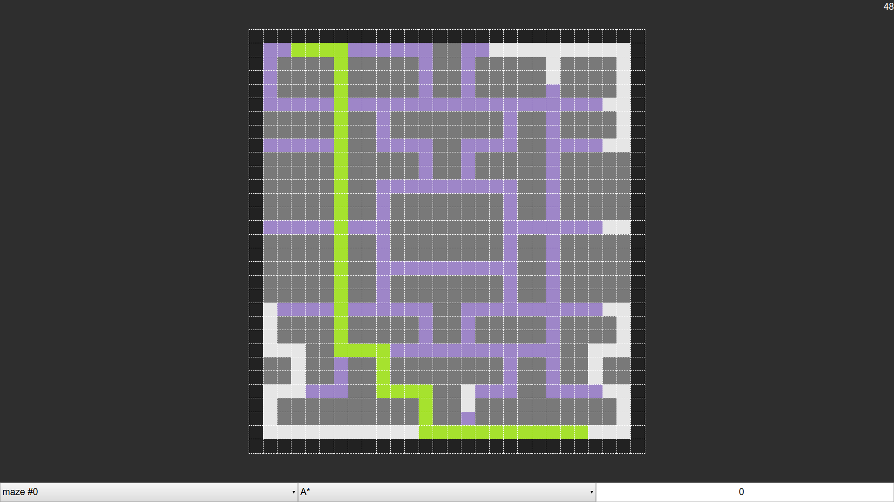

# ai-search



Implementation of 5 different AI search algorithms:

- Depth First Search (`depth_first_search`)
- Breadth First Search (`breadth_first_search`)
- Best First Search (`best_first_search`)
- A* (`a_star`)
- Hill Climbing (`hill_climbing`)

## Dependencies

### `make`

`make` was used to compile the source code and as an entrypoint to execute a few scripts. The version of `make` that was used:

```
make --version
GNU Make 4.3
Built for x86_64-pc-linux-gnu
Copyright (C) 1988-2020 Free Software Foundation, Inc.
License GPLv3+: GNU GPL version 3 or later <http://gnu.org/licenses/gpl.html>
This is free software: you are free to change and redistribute it.
There is NO WARRANTY, to the extent permitted by law.
```

### `g++`

The search algorithms were implemented in C++. The version of `g++` that was used:

```
$ g++ --version
g++ (GCC) 10.1.0
Copyright (C) 2020 Free Software Foundation, Inc.
This is free software; see the source for copying conditions.  There is NO
warranty; not even for MERCHANTABILITY or FITNESS FOR A PARTICULAR PURPOSE.
```

### `nodejs`

The visualization of the algorithms was implemented in Javascript. The version of `node` that was used:

```
$ node --version
v14.3.0
```

### `yarn`

`yarn` is the depency manager for `nodejs`. The version that was used:

```
$ yarn --version
1.22.4
```

## Scripts

### `make` <sub>or `make build`</sub>

Compile all search algorithms. Each algorithm is a different program.

The binaries are saved in the `.bin` directory.

### `make clean`

Remove the `.bin` directory and its contents.

### `make exec a=[algorithm] m=[maze-index]`

#### `[algorithm]` is one of:

- `depth_first_search` or `dfs`;
- `breadth_first_search` or `bfs`;
- `best_first_search` or `bsfs`;
- `a_star` or `as`;
- `hill_climbing` or `hc`.

#### `[maze-index]` is a number from `0` to `9`

E.g. to execute the A* search on the maze `0.txt`:

```
make exec a=as m=0
```

Or to do it manually:

```
./.bin/a_star < __mazes__/0.txt 2> /dev/null
```

The part "`2> /dev/null`" is required to throw away the program's `stderr` output.

The `stderr` output has been used to log the algorithms execution and later serve as data to render a simple visualization of this algorithm's execution.

### `make benchmark n=[number-of-iterations]`

#### `[number-of-iterations]` is a number. The default is `100`

This parameter controls how many times each algorithm should be executed on each maze.

As it finishes, this script will print the average times for each algorithm on each maze.

It will also print whether the search was successful or failed (i.e., whether it found the target node).

### `make visualization`

This will start a process that will serve a web page. A tab/window on your default web browser will automatically open. This web page renders the different algorithms' executions on each maze.
